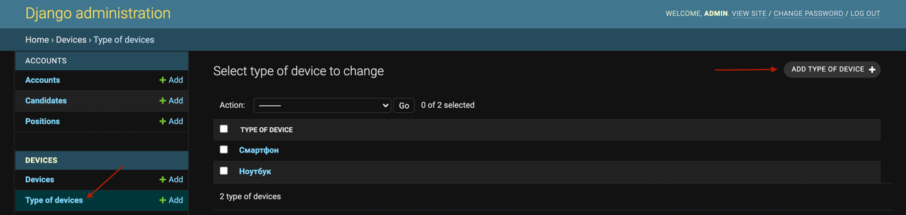

## Базовая настройка проекта

1. Установка виртуального окружения и всех необходимых пакетов

````
python -m venv venv
source env/bin/activate
pip install -U pip
pip install -r requirements.txt
````

2. Настройка переменных окружения в файле `setenv.sh` (Токен для Телеграм бота и данные для подключения к базе данных)
3. Установка переменных окружения
````
./setenv.sh
````
4. Создание и применение миграций моделей
````
python manage.py makemigrations
python manage.py migrate
````
5. Установка и настройка веб-сервера(nginx, apache или любой другой сервер) и Gunicorn
6. Сбор статических файлов
````
python manage.py collectstatic
````
-------------------------
## Начало работы с сервисом
1. Создание аккаунта суперпользователя
````
python manage.py createsuperuser
````
2. Добавление должностей в панели администратора

3. Добавление типов тестовых устройств и самих устройств


4. Добавление мессенджеров(Telegram, Slack и т.д.) и систем(GitHub, GitLab и т.д.)

-------------------------
## Панель администратора
<br>
На панели администратора расположены такие разделы как 
- Пользовательские аккаунты(Accounts)
- Список кандидатов(Candidates)
- Список должностей(Positions)
- Список тестовых устройств(Devices)
- Список типов тестовых устройств(Type of devices)
- Список мероприятий(Events)
- Список точек на карте(Markers)
- Список бесед(Conversations)
- Список мессенджеров, в которых расположены беседы(Messengers)
- Список систем(Systems)